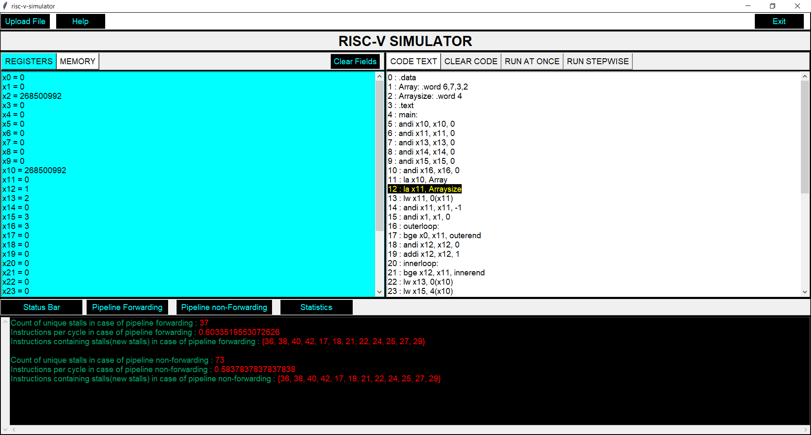
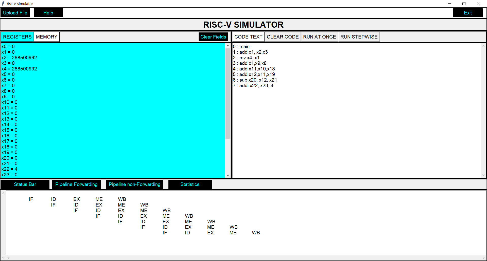
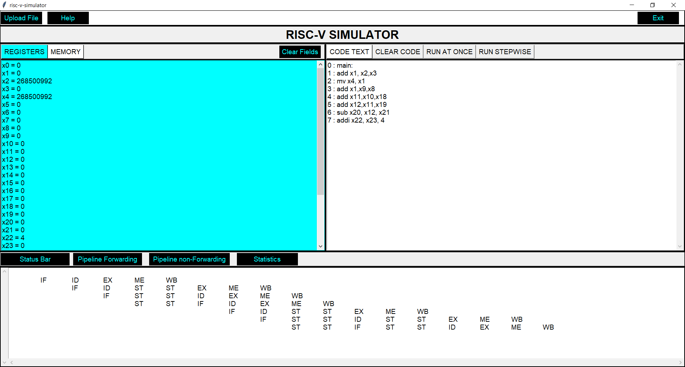
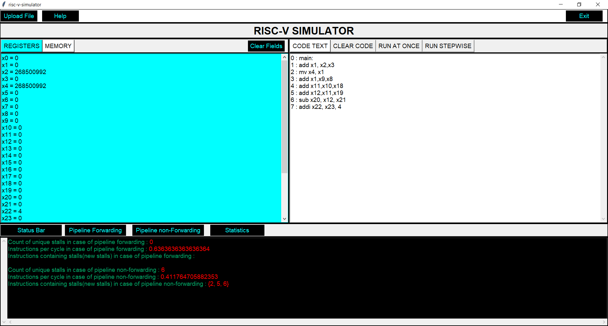

# Screenshots

# Guidelines

### How to run my code?

- Clone the repo in your system
- make the desired .s or .asm file in folder
- Open gui2.py
- Run gui2.py
- Upload file using 'upload file' option in top left corner
- By default, the window will show the add_inss.asm file

